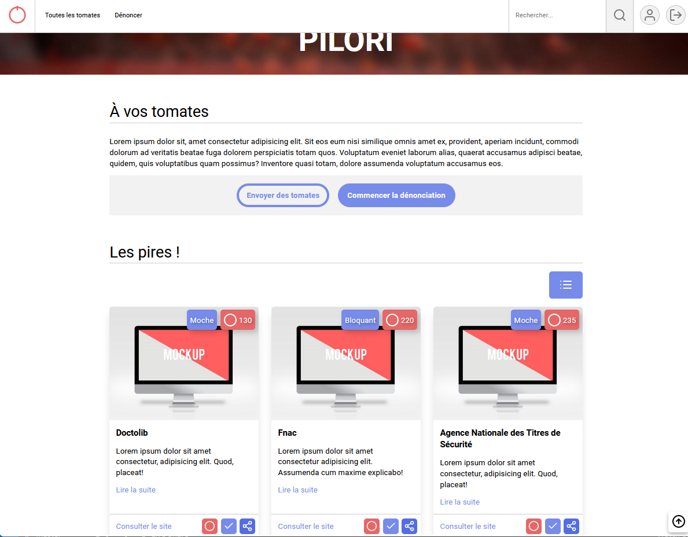

# Pilori

Pilori est un projet web "fil rouge" développé dans le cadre de ma formation. Il s'agit d'un site web qui vise à dénoncer les sites inaccessibles aux personnes en situation de handicap. Le projet utilise l'architecture MVC (Modèle-Vue-Contrôleur) pour organiser et structurer le code de manière claire et maintenable.




# A venir
Connexion à une BDD

## Dépendances
Les dépendances suivantes sont utilisées dans ce projet :

- node-dev: ^8.0.0
- bcrypt: ^5.1.0
- dotenv: ^16.0.3
- ejs: ^3.1.9
- express: ^4.18.2
- express-session: ^1.17.3
- slugify: ^1.6.6
- validator: ^13.9.0

## Description
Pilori est un site web conçu pour dénoncer les sites qui ne respectent pas les standards d'accessibilité pour les personnes en situation de handicap. Il permet aux utilisateurs de signaler les sites problématiques et de partager leurs expériences. Le projet suit l'architecture MVC, ce qui facilite la séparation des responsabilités et la gestion du code.

## Installation
Pour installer et exécuter ce projet localement, suivez les étapes suivantes :

- Clonez ce dépôt sur votre machine 
- Installez les dépendances nécessaires en exécutant la commande suivante avec `npm install`
- Configurez les variables d'environnement en créant un fichier `.env ` à la racine du projet et en y définissant les valeurs appropriées.

# Sous-module
Ce projet utilise également un sous-module appelé "inte-pilori". Pour récupérer le sous-module, suivez les étapes suivantes :

Assurez-vous que vous avez déjà cloné le dépôt principal du projet, comme indiqué précédemment.
Initialisez et mettez à jour le sous-module en utilisant la commande suivante :
```
git submodule init
git submodule update --recursive --remote
```
Cela récupérera le sous-module "inte-pilori" et placera son contenu dans le répertoire approprié à l'intérieur de votre projet.
A noter : L'accessibilité n'a pas été faite by design dans le submodule mais a posteriori dans le projet Pilori.

# Lancez l'application
En utilisant la commande suivante :`npm start`

N'hésitez pas à contribuer à ce projet en ouvrant des problèmes ou en soumettant des pull requests.
